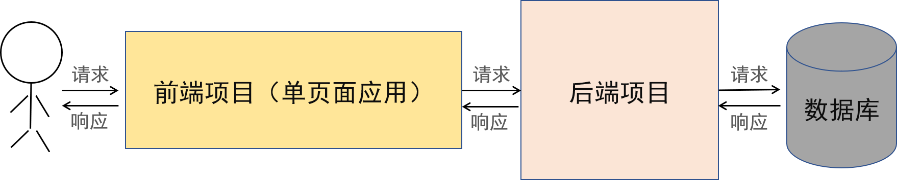
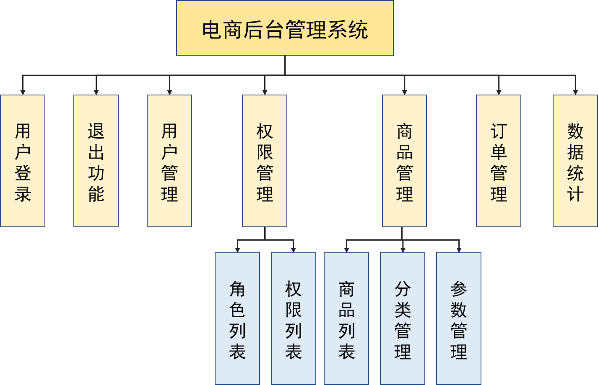

# vue-shop

#### 介绍

摸鱼六佬的前端项目，学习构建电商后台管理系统前端网站

学习目标：入门前端 vue 开发，了解前后端分离技术。



项目结构

```
$ tree .
vue-shop
├─code  项目代码
├─docs  文档、学习资料、任务计划等
└─img   需要的图片
```

#### 功能模块划分



1. 登录/退出功能
2. 用户管理模块
3. 权限管理模块
4. 分类管理模块
5. 参数管理模块
6. 商品管理模块
7. 订单管理模块
8. 数据统计模块

#### 本周学习任务

1. 了解前端基础知识，了解 node 和 vue
2. 学习 git 基本操作与 github 或码云的使用
3. 至少看完前 10 个视频

- [ ] 01.Vue 项目实战学习目标
- [ ] 02.Vue 项目实战概述
- [ ] 03 电商后台管理系统的功能
- [ ] 04 开发模式:前后端分离
- [ ] 05 项目初始化
- [ ] 06 初始化 Git 远程仓库
- [ ] 07 本地项目托管到 GitHub 或码云中
- [ ] 08 后台项目的环境安装配置
- [ ] 09 测试后台接口是否正常
- [ ] 10.登与退出功能

#### 参考资源

[B 站学习课程](https://www.bilibili.com/video/av90846070)

[前端学习参考路线](https://www.cnblogs.com/qianguyihao/p/8776837.html)

[MDN 官方文档](https://developer.mozilla.org/zh-CN/)

[Vue 中文文档](https://cn.vuejs.org/)
